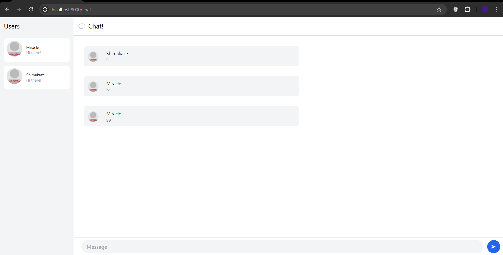
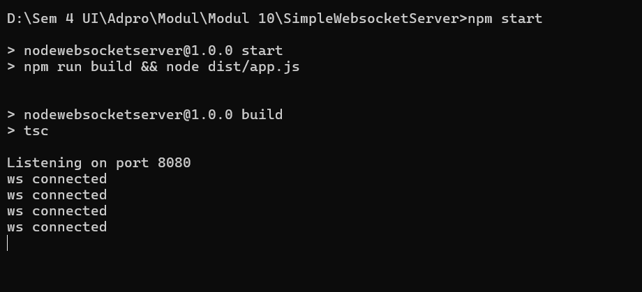
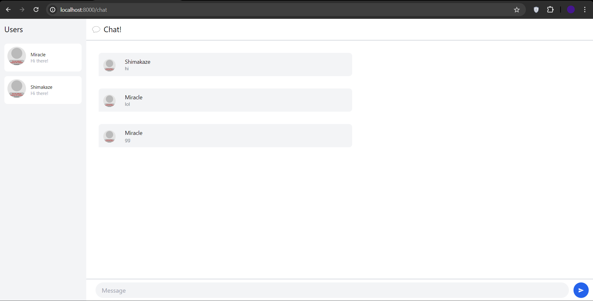
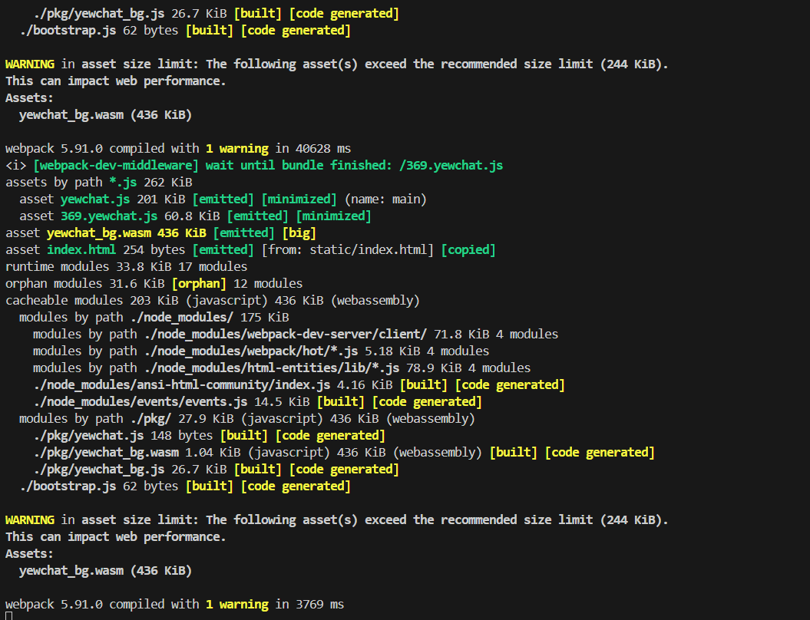

Modul 10 tutorial 3

3.1 Original code

User : Miracle

Server:

User: Shimakaze 

Yewchat:

When server and Yewchat running we can access localhost:8000 to create user then we can chat with many pepople .

